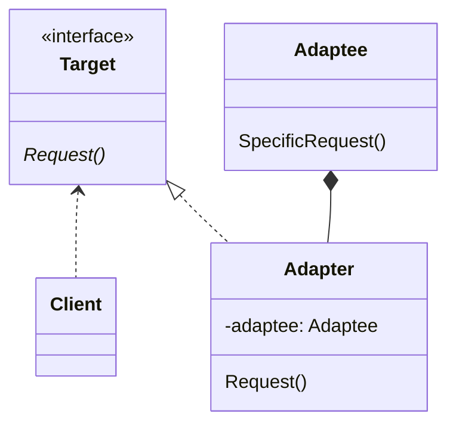

# Adapter Pattern

Convert the interface of a class into another interface that clients expect.
The Adapter pattern lets classes that have incompatible interfaces work together.

https://learning.oreilly.com/library/view/design-patterns-elements/0201633612/ch04.html#page_139

## Scenario

Sometimes you want to reuse a class (or set of classes), but the interface
doesn't match the interface that the application requires.

The class(es) you want to reuse can be anything from a 3rd-party product
or library, to an existing class in the same application - the important
part is that although the class's functionlity is exactly what you need,
its interface doesn't match what you need it to match.

## Participants

### Objects

- `Client`: the rest of the program that needs to use some
desired functionality

- `Target`: defines the interface that the `Client` want to use for
the desired functionality

- `Adaptee`: the existing class that contains the desired functionality,
but does not match the `Target` interface

- `Adapter`: class that uses the `Adaptee` to implement the `Target` interface 

### Interactions

- the `Client` calls the `Adapter`, which calls a method(s) on the `Adaptee`
to perform the desired behavior

- the `Adapter` is also responsible for formatting the input/output data
(if necessary) to translate between the `Target` interface and the
`Adaptee`'s interface

### UML

## Benefits

The key benefit of this pattern is that you can leverage the functionality
of an existing/3rd-party class(es) when it can't be directly plugged in to
the application.

Specifically:

- you can reuse a class(es) that contains the desired functionality
but do not match the required interface

- you can add functionality to a class (or multiple) when you
can't/shouldn't change the class itself

## "Class" Adapter vs "Object" Adapter

There are generally two kinds of adapters: a "class" adapter and
an "object" adapter.

The "class" adapter is a subclass of the `Adaptee`, and makes calls
to the base class. The "object" adapter has an `Adaptee` field
and makes calls to the `Adaptee` object.

Both variations are functionally similar, though there are some
slight consequences.

For a "class" adapter:
- the `Adapter` is bound to a specific `Adaptee` class, and cannot directly
work with the `Adaptee`'s subclass (you'd have to create a new adapter)
- the `Adapter` can override some of the `Adaptee`'s behavior
- In languages without multiple inheritance, you cannot create a "class"
adapter if the `Target` is actually an abstract class

For an "object" adapter:
- a single `Adapter` can work with any `Adaptee` subclass automatically, and
can add behavior to all subclasses in one place
- an `Adapter` can't directly override behavior of the `Adaptee`
