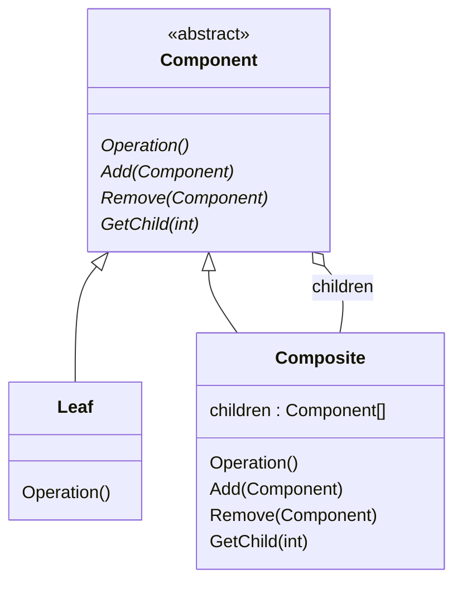

# Composite Pattern

Compose objects into tree structures to represent part-whole hierarchies. 
Composite lets clients treat individual objects and compositions of objects uniformly.

https://learning.oreilly.com/library/view/design-patterns-elements/0201633612/ch04.html#page_163

## Scenario

Sometimes you have a set of objects that can be grouped together recursively
(forming a tree-like structure), and you want to be able to easily work
with both the individual objects and the groupings in the same fashion.

The Composite pattern provides a common interface between the individual
objects and the groups of objects, so that common operations can be
performed regardless of what the underlying object actually is.

## Participants

### Objects

- `Component`: the common interface/superclass for both `Leaf` and 
`Composite`, containing common operations and child-management actions.

- `Leaf`: a primitive object in the hierarchy that cannot have children

- `Composite`: an object that contains other `Leaf` or `Composite` objects
inside (like a grouping)

**Notes**: there can be multiple different `Leaf` classes (and even 
multiple `Composite` classes).

### Interactions

- clients only interact with the `Component` base class for most operations

- `Leaf` classes directly implement the common operations

- `Composite` classes usually implement the common operations by forwarding
the request to all of its children (sometimes adding logic before or
after forwarding)

### UML

## Consequences

All of the consequences stem from blurring the distinction between Leaf
and Composite objects.

### Benefits

The main benefits is that it is much easier & simpler to work with the
tree of objects - most of the time the client doesn't need to worry about
if they are operating on a leaf object or a composite object.

There is also a side benefit: it follows the "Open/Close Principle". It
is much easier to add a new leaf (or composite) class to the hierarchy.
You just have to add an additional subclass, and don't have to update any
of the client code. 

### Pitfalls

It can be easy to overgeneralize the Component interface, especially when
there is not a clear set of common operations that can be shared between
all components. This can make the hierarchy harder to understand, maintain
and use.

## Variations

There are a number of ways the pattern can be tweaked:

- Components can additionally hold a reference to its parent - this can
make traversing & removing components easier.

- There is a design decision/trade-off with what/how much is defined in the
common Component interface; it's a trade-off between "transparency" and
"safety".

- Sometimes it's helpful to add an "escape hatch"/a way to convert a
Component to its specific Leaf or Composite subclass, so that you can
interact subclass specific methods.

- Children can be stored as any kind of collection - ordered list, 
unordered set, keyed dictionary, etc.
