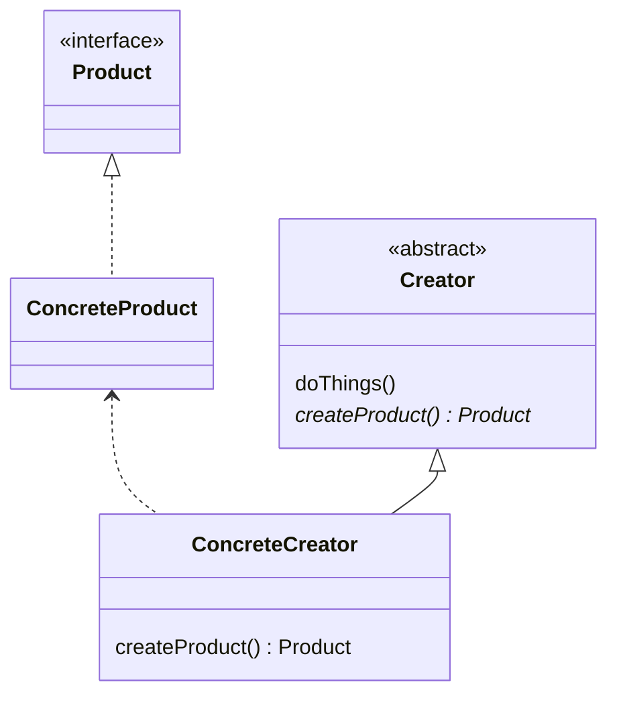

# Factory Method Pattern

Define an interface for creating an object, but let subclasses decide which
specific class to instantiate.

https://learning.oreilly.com/library/view/design-patterns-elements/0201633612/ch03.html#page_107

## Scenario

Sometimes you have a several classes that implement an interface, and you want a common way
to create instances so that code that uses the interface doesn't need to explicitly pick
a class; instead, which specific class is instantiated is determined somewhere else in
the application (possibly through a config/settings).

This is a common scenario in frameworks - the framework code needs to be able to create
instances of an interface in an abstract way, since the framework has no knowledge of the
application classes that implement the interface.

This pattern has a similar effect to Dependency Injection; the client code is decoupled from
the actual class that it instantiates. The difference is that in DI the interface instance
is passed in (ie through a constructor), but the Factory Method uses inheritance to decouple
interface intantiation into the subclasses.

## Participants

### Objects

- `Product`: the interface for the objects created by the factory method

- `ConcreteProduct`: implements the `Product` interface

- `Creator`: declares the abstract (or virtual) factory method, and calls the method
to create `Product`s

- `ConcreteCreator`: overrides the factory method to return a `ConcreteProduct`

**Notes**: the purpose of the `Creator` is **not** just to create `Products`, creating
`Products` is a just a small step in it's main logic - the factory method helps decouple
the `Creator`'s main logic from the `ConcreteProduct` classes. 

### Interactions

- `Creator` relies on it's subclasses (`ConcreteCreator`) to implement the factory method
to return the appropriate `ConcreteProduct`

### UML

## Benefits

There are a couple of related benefits of this pattern:

- The product creation code is separated from the core functionality of the Creator,
which lessens the coupling between Creators and Products.

- It is easier to add new Product subclasses without breaking existing client code.

## Related Patterns

The **Factory Method** is basically a **Template Method** where the abstract operation
creates a Product. A **Factory Method** can also be used as a step inside a
**Template Method**.

The **Factory Method** is commonly used with the **Iterator** pattern; the method in the
Aggregate to create/get an Iterator can be a factory method to allow subclasses to
return different iterator types.

