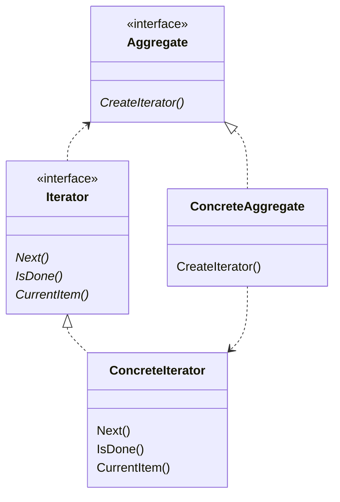

# Iterator Pattern

Provide a way to access the elements of an aggregate object sequentially without exposing its 
underlying representation.

https://learning.oreilly.com/library/view/design-patterns-elements/0201633612/ch05.html#page_257

## Scenario

Some objects represent a collection of other objects (ie List, Tree, etc), and very often
there needs to be a way (or multiple ways) to traverse all the elements in a collection.

There are multiple ways to add this traversal behavior (ie traverse manually, add methods
directly on the collection), but generally it is best if the collection's internal structure
is kept hidden and the traversal behavior is separated from the collection itself - that's what the Iterator pattern acheives.

## Participants

### Objects

- `Iterator`: an interface for accessing & traversing elements

- `ConcreteIterator`: an implementation of the `Iterator` interface for a
certain `Aggregate`

- `Aggregate`: an interface with a method to get an `Iterator`

- `ConcreteAggregate`: an implementation of the `Aggregate` that provides
the correct `ConcreteIterator` instance

**Notes**: `Aggregate` has many other names, including `Iterable`, `Collection`,
and `IEnumerable`.

### Interactions

- the `ConcreteIterator` needs to keep track of the current element in the aggregate
and be able to get the next element

### UML

**Notes**: the `Iterator` doesn't need to have this interface exactly - the key thing is
that there is some way to access the current element, some way to move to the next element,
and some way to tell when the iterator is done.

## Benefits

The key benefits is that the traversal logic & behavoir are completely separated from the
collection itself.

This results in several direct benefits:

- the Aggregate interface is cleaner since it doesn't contain traversal logic
(Single Responsibility Principle)

- you can have multiple ways to iterate over a single collection class, and it's easy to
add more (Open/Close Principle)

- traversals can be paused and resumed on demand (and even reset if the iterator supports it)

- multiple traversals can be happing on a single collection object at the same time

## Variations

There are a couple of different ways this pattern can be tweaked to result in different
variations:

- The iteration movement can be controlled by either the client (**external iterator**/
**active iterator**) or the iterator itself (**internal iterator**/**passive iterator**)

- The traversal algorithm can be defined in the iterator, or it can be defined in the
aggregate itself (this kind of iterator is called a **cursor**)

- A **robust iterator** ensures that insertions & removals into the aggregate do not
interfere with the traversal.

- Iterators can have extra operations other than `Next`, `Current`, `IsDone` (for example,
`Previous`, `Reset`, `SkipTo`)
