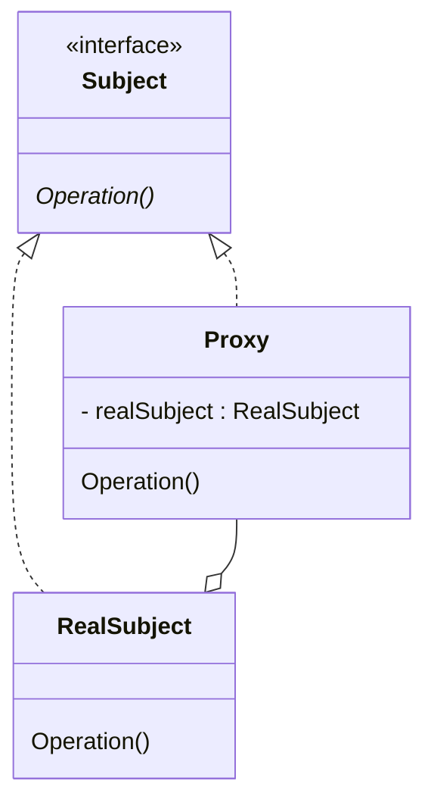

# Proxy Pattern

Provide a placeholder for another object to control access to the original object,
allowing you to tweak the behavior of the original object.

https://learning.oreilly.com/library/view/design-patterns-elements/0201633612/ch04.html#page_207

## Scenario

Sometimes you have an existing object that you want to add some peripheral behavior to
(permissions checks, log operations, lazy intialization, cache results, etc). Rather than
modifying the existing object or modifying every place its used, you can add a proxy
to stand between the existing object and the clients, and add that behavior to the proxy itself.

For example, if you have an object that takes a lot of system resources (a DB, a large file, 
etc), it would be beneficial to add some lazy initialization to only create the object when
it's truly needed. To avoid adding the lazy initialization handling to every client that uses
the object, you can introduce a proxy that handles it (and it is transparent to all the clients).

## Participants

### Objects

- `Subject`: the common interface for the `Proxy` and the `RealSubject`; this is what
all clients interact with

- `RealSubject`: the real object that the proxy represents

- `Proxy`: the stand-in for the real object; implements peripheral behavior, and delegates
core behavior to the `RealSubject`

### Interactions

- `Proxy` forwards requests to the `RealSubject` to perform the actual behavior.

- the presence of the `Proxy` should (generally) be invisible to the clients.

### UML

## Benefits

The core benefit is that there is a centralized object that controls access to
the subject object and can add auxiliary behavior around it. The proxy object is
(generally) invisible to clients, so it can be swapped in & out at will. There can
also be multiple proxies provide different auxiliary behavior.

### Possible Uses

The possible functionalities that proxies can offer are practically endless. Here
is a short list of some examples:

- Lazy initialization - only initialize the real object when needed
- Access control - only allowing clients with permissions to invoke some operations
- Logging/recording operations - record the operations performed on the underlying
object (eg for debugging or audit purposes)
- Local instance of remote service - provides a local instance that passes all
requests over the network to the actual service
- Result caching - cache results from certain operations
- Copy-on-write wrapping - copy the underlying object whenever it is modified
