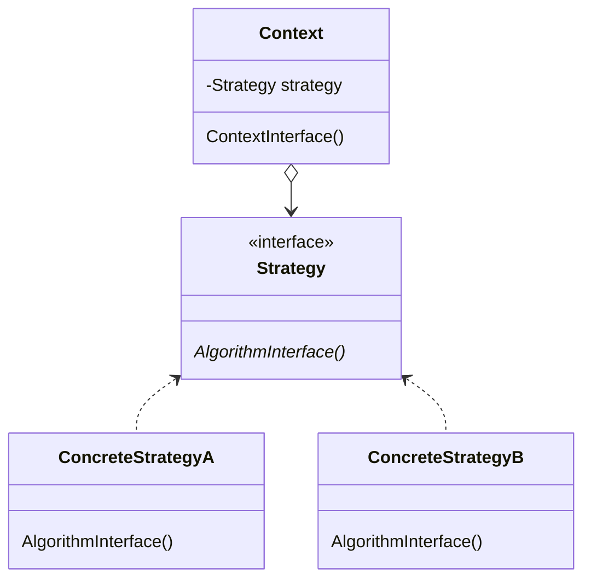

# Strategy Pattern

Defines a family of algorithms, puts each in its own class, and makes them interchangeable.
The Strategy pattern lets the algorithm implementation be decoupled from the classes that use it.

https://learning.oreilly.com/library/view/design-patterns-elements/0201633612/ch05.html#page_315

## Scenario

Sometimes you need to be able to pick/swap out the underlying algorithm of a module/system,
possibly at runtime. This can be for a variety of reasons: performance trade-offs,
getting results tailored to a certain scenario, or simply to increase the extensibility
(so new algorithms can be added at-will in the future).

The Strategy pattern plays well with (basically is) Dependency Injection, since it decouples
the concrete algorithm implementation from the class that uses it, and requires that a concrete 
instance be passed in from the outside code.

## Examples

Here are some example use cases of the Strategy pattern:
- sorting algorithms - each algorithm performs slightly differently depending on the input;
you could swap out the sorting algorithm used at run-time to based on the given input
- navigation algorithms - there can be different algorithms to find directions based on if
you are driving a car, or riding a bike, and if you don't want to pay for tolls, etc
- text formatting - you could swap out the algorithm for text formatting based on a config/
the user's settings; you could even support 3rd parth formatting algorithms (aka plugins)

There are even some real-world examples that follow this pattern:
- different traveling methods (walking, car, plane) - each method performs the same function
(getting you from point A to point B), but each has a different trade-off between
travel time & monetary cost
- different golf clubs - all are used the same way and have the same general function, but
each club is performs best in a different scenario

## Participants

### Objects

- `Strategy`: an interface for all supported algorithms to follow

- `ConcreteStrategy`: a concrete algorithm implementation that implements
the `Strategy` interface

- `Context`: class that gets configured with a `Strategy` and invokes
the `Strategy` operaions

### Interactions

- the `Strategy` recieves all the required data directly from the `Context` (the `Strategy` can
even get passed the `Context` itself and access all required data off of it)

- the `Context` doesn't pick the `ConcreteStrategy`; the caller passes a `ConcreteStrategy` to 
it, usually at construction time though it can also be configurable through a setter (a la
Dependency Injection)

- most commonly, the `Strategy` only contains one method (to perform the operation); though
sometimes the `Strategy` can contain multiple, related methods 

### UML

## Consequences

### Benefits

The key benefits is that the algorithm implementation is decoupled from the code that uses
it, allowing different algorithm implementations to be swapped out (even at run-time).

Some additional benefits:
- its easy to add additional algorithms in the future

- avoids the code duplication that would happen if you subclassed the `Context` for each
different algorithm implementation

- the algorithm implementation details are isolated from the calling code, and each algorithm
is cleanly separated from the other algorithms

### Pitfalls

There are a couple of pitfalls to be aware of:
- clients must be aware of and understand the difference between all the different strategies,
which may not matter or be relavent to them

- many (most?) modern programming languages have support for first-class/anonymous functions, 
which usually can be used the same way as the Strategy pattern, but does not bloat the
codebase with additional classes & interfaces

