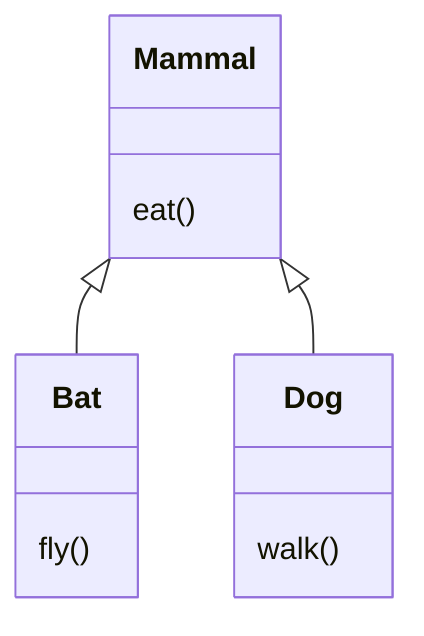
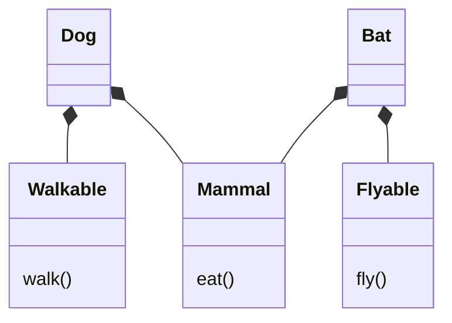
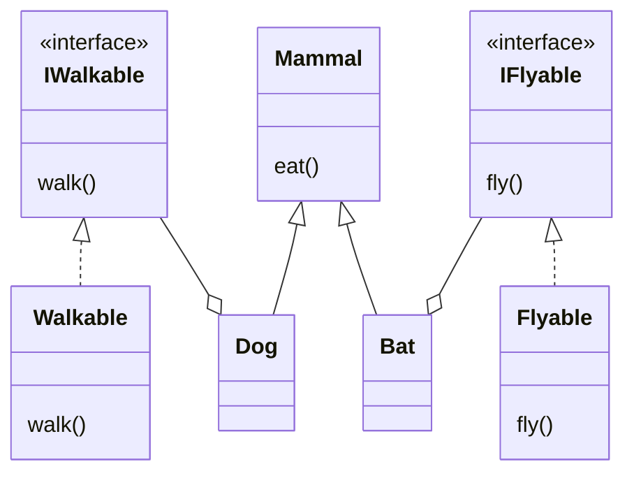

# Coupling Example

This example demonstrates the different levels of coupling when using
different design concepts: **inheritance**, **composition (aggregation)**
and **dependency injection**.

Each example will model two related, concrete classes, **Dog** and **Bat**.

## Inheritance

**Issues**:
A lot, but not all, mammals walk (or fly) - we must decide where to locate these methods.
We could create `FlyingMammal` and `WalkingMammal` intermediate classes, but that's
inelegant and a steep slope.

**Rule of Thumb: only use inheritance in truly polymorphic situations**

## Composition (aggregation)

Each behavior has its own class, which is included in `Dog`/`Bat` via composition.

**Benefits**: Adding new animal (`Whale`) or new behavior (`Swimmable`) doesn't require changing
any existing classes, just adding new ones.

**Issues**: Behavior classes are directly instantiated in the parent classes, which makes
the classes highly coupled.

## Composition with Dependency Injection

Rather than directly instantiating the `Walkable` behavior class in `Dog`, we compose the
interface (`IWalkable`), and require the caller provide `Dog` with the behavior instance
(same with `Bat`/`Flyable`).

`Dog` can allow the `IWalkable` instance to be provided via the constructor, or
a "setter" method (or both) - this is the core idea behind Dependency Injection.

Depenency Injection is one way to implement the "Inversion of Control" principle:
make it someone else's responsibility to provide an instance of a dependency.

