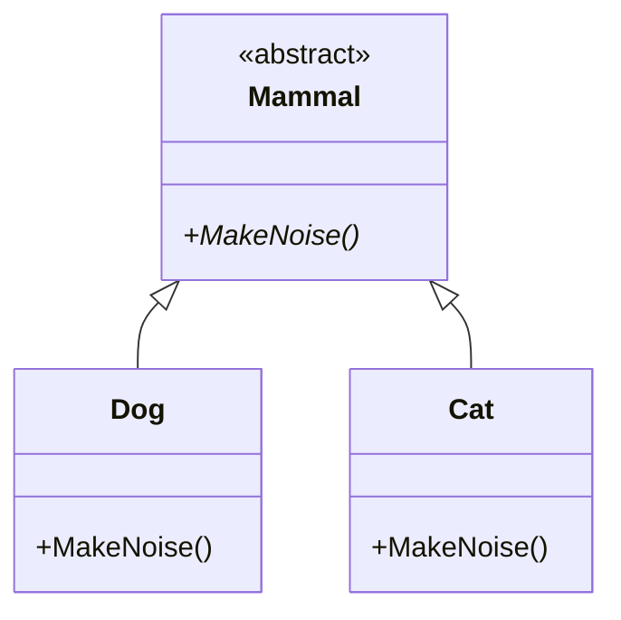
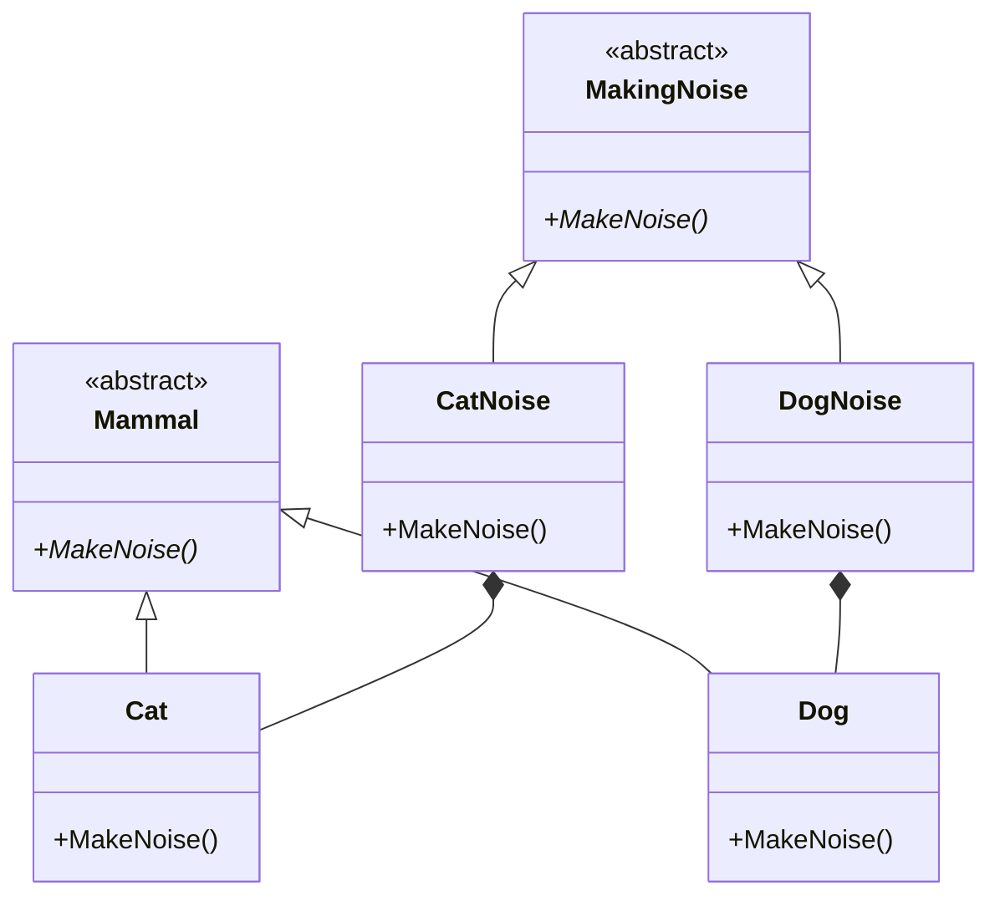
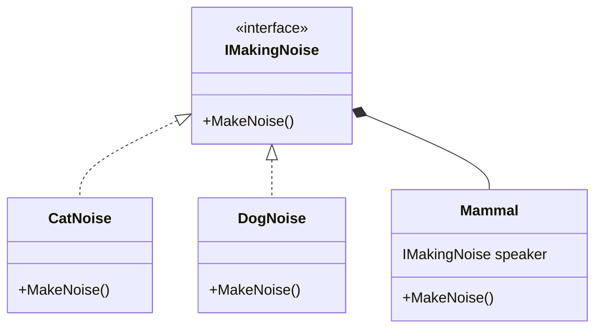

# Dependency Inversion Principle Examples

The Interface Segragation Principle states two things:
1. "A high-level module should not depend on low-level modules. Both should 
depend on the abstraction"
2. "Abstractions should not depend on details. Details should depend on 
abstractions."

The Goal of Dependency Inversion is to couple to something abstract, rather than 
concrete, and also to choose objects at runtime rather than compile time.

## Initial Example

In this example, we have a `Mammal` base class with two subclasses, `Dog` and 
`Cat`.

**Issues:** the mammals and the behavior are tightly coupled together. 

## Seperating Out Behavior

Here we separate out the mammal behaviors from the mammals themselves.

**Issues:** `Cat` is directly instantiates the `CatNoise` behavior (likewise 
with `Dog`). `Cat` (a high-level class) is still depending directly on `CatNoise` 
(a low-level class).

## Dependency Injection

The last step is to use **Dependency Injection** to fully decouple the high-level
classes from the low-level behavior. In this example, the only difference between
`Dog` and `Cat` is the noise it makes; hence if the noise is injected, there is
no need for separate subclasses, we can just use the Mammal class

