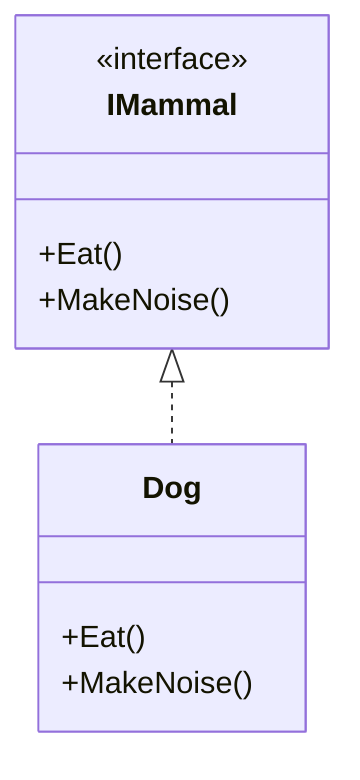
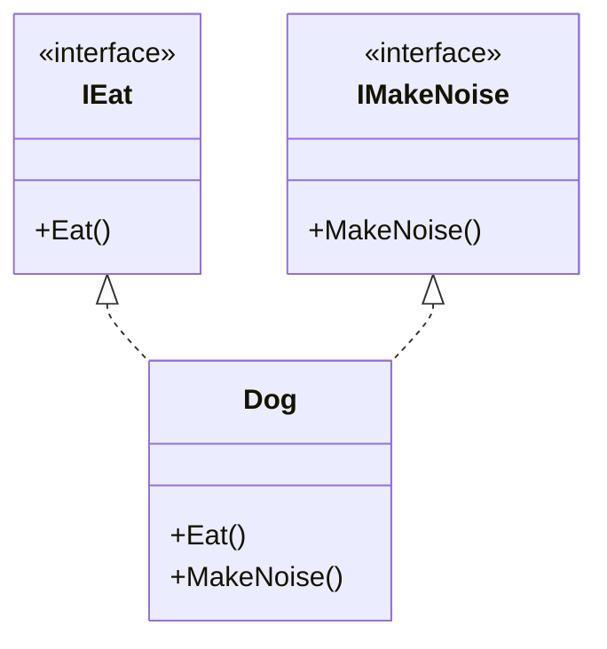

# Interface Segragation Principle Examples

The Interface Segragation Principle states that "Clients should not be forced to
depend upon interfaces that they do not use.".

Everything inside an interface should be very closely related. In general, it is 
better to have many small interfaces than a few larger ones.

## Without ISP

In this example, we have a mammal interface that contains all mammal behaviors.

**Issues:** the `IMammal` interface contains two behaviors that aren't tightly
related (eating, and making noise). Any class that an object that eats is also
forced to depend on the making noise behavior, since they are in the same 
interface. 

## With ISP

Instead eating and making noise should be split into separate interface, and 
`Dog` can implement both of them.

