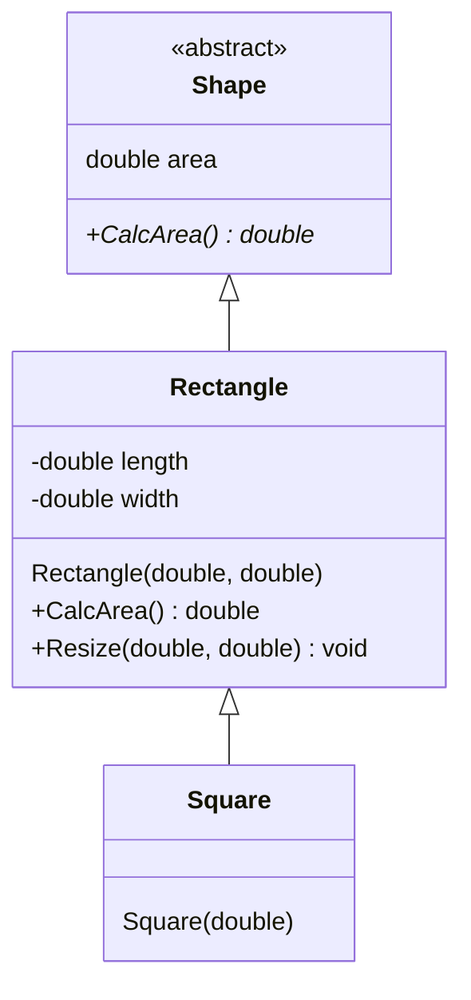
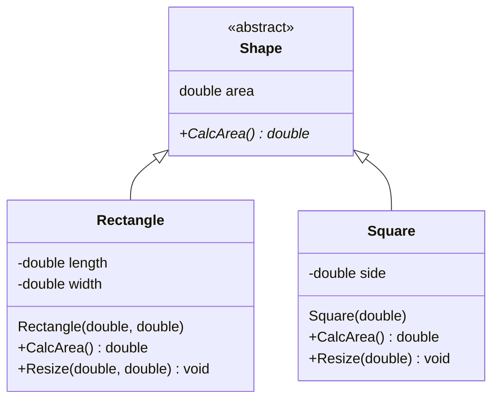

# Liskov Substitution Principle Examples

The Liskov Substitution Principle states that "Any instance of a parent class 
must be able to be replaced with an instance of a child class".

If a parent class can do something, a child class must also be able to do it.

## Without LSP

In this example, we have a class hierarchy with Shape, Rectangle, and Square.

**Issues:** the `Square` class isn't exactly a `Rectangle`, it just fakes it in
this example - for example, how can `Square` handle the `Resize(w, l)` operation? 

## With LSP

Instead `Rectangle` and `Square` should be separate direct subclasses of `Shape`.

