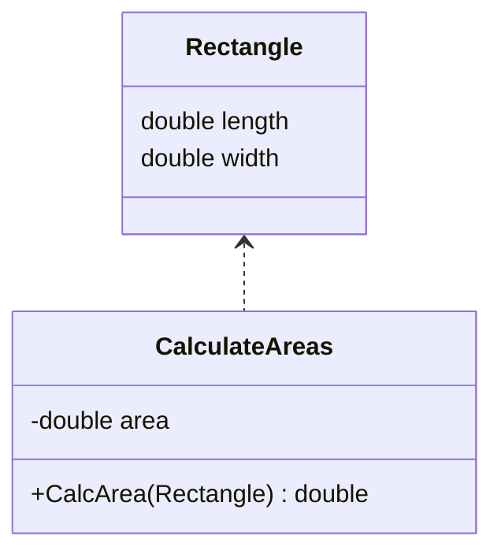
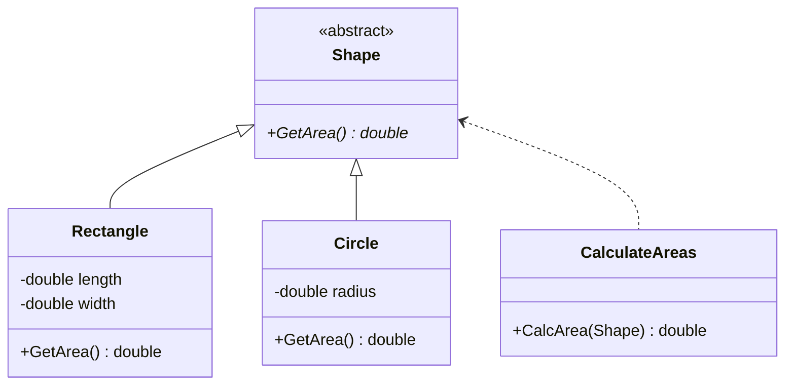

# Open/Close Principle Examples

The Open/Close Principle states that "a class should be open for extension, and 
closed for modification".

You should be able to extend a class’s behavior, without modifying it.

## Without OCP

In this example, we have a class that calculates the area of rectangles.

**Issues:** the `CalculateAreas` class only handles rectancles, if we wanted
to add another shape we'd have to modify the existing behavior.

## With OCP

Instead we should extend our code via subclasses, that way the original classes
don't need to be changed

