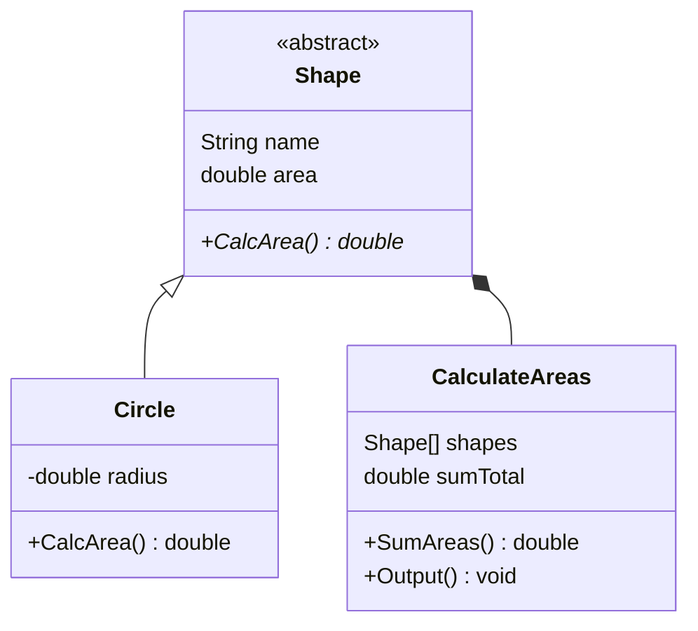
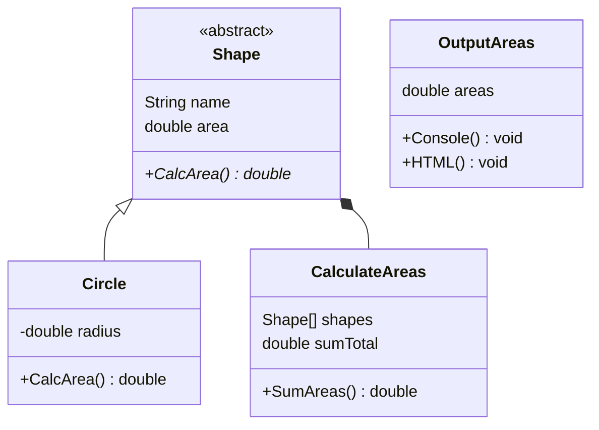

# Single Responsibility Principle Examples

The Single Responsibility Principle states that "a class should have only a single
reason to change".

Every module or class should have responsibility over a single part of the
functionality provided by the software, and that responsibility should be 
entirely encapsulated in the class.

## Without SRP

In this example, we have a heirarchy of shapes and a way to sum the areas of 
multiple shapes together.

**Issues:** the `CalculateAreas` class handles summing areas as well as output
for the application - that's two responsibilities.

## With SRP

What if we wanted to update this to also allow printing out HTML as well as just 
text? If the area calculation and output responsibilites are split into two 
classes, not as much needs to be updated.

